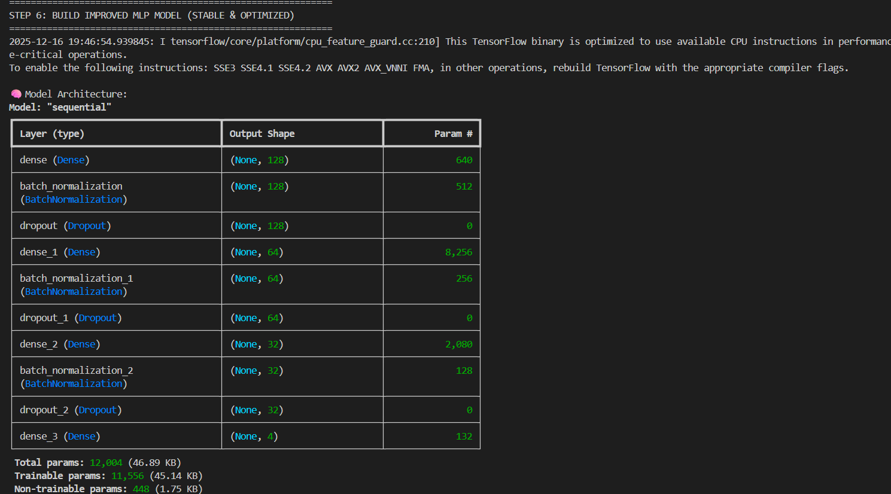
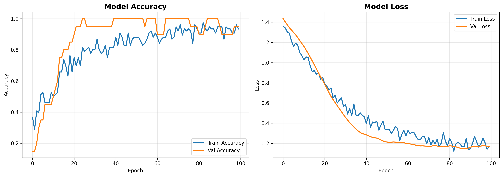
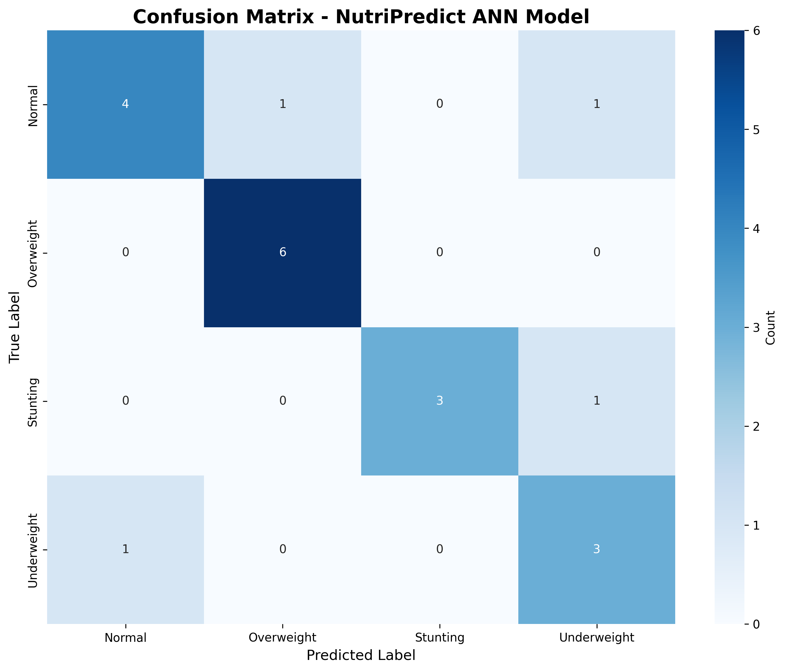
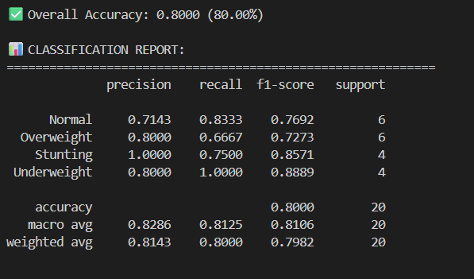

# 🍼 NutriPredict - Sistem Prediksi Stunting Berbasis Artificial Neural Network

Sistem cerdas untuk memprediksi risiko stunting pada anak menggunakan **Artificial Neural Network (ANN)** dengan tujuan memberikan intervensi dini dan rekomendasi gizi personal, serta kebutuhan pengumpulan project akhir mata kuliah kecerdasan artificial.

---

## 🎯 Tentang Proyek

**NutriPredict** adalah sistem prediksi stunting yang dikembangkan untuk membantu tenaga kesehatan dan pemerintah dalam melakukan deteksi dini risiko stunting pada anak. Sistem ini menggunakan pendekatan **Artificial Neural Network (ANN)** untuk menganalisis data multidimensi meliputi:

- ✅ **Data Gizi**: Tinggi badan, berat badan, usia
- ✅ **Data Demografis**: Jenis kelamin
- ✅ **Status Kesehatan**: Normal, Overweight, Underweight, Stunting

Proyek ini dikembangkan sebagai bagian dari tugas **Mata Kuliah Kecerdasan Artificial** di **Universitas Syiah Kuala**.

---

## 📊 Latar Belakang

Stunting masih menjadi permasalahan gizi utama di Indonesia. Berdasarkan data Kementerian Kesehatan tahun 2023:

- 📉 **21,5%** anak Indonesia mengalami stunting
- ⚠️ Target pemerintah: menurunkan prevalensi stunting hingga **14%**
- 🏥 Intervensi sering dilakukan **terlambat**, bukan secara preventif

### Masalah Utama:

1. Pencegahan masih dilakukan secara manual tanpa analisis prediktif
2. Data gizi dan sosial ekonomi belum dimanfaatkan secara optimal
3. Kurangnya sistem terintegrasi untuk deteksi dini

### Solusi:

**NutriPredict** memanfaatkan machine learning untuk:

- 🔍 Prediksi risiko stunting 6-12 bulan ke depan
- 🎯 Memberikan rekomendasi intervensi personal
- 📈 Membantu tenaga kesehatan melakukan deteksi dini lebih efektif

---

## ✨ Fitur Utama

### 1. 🧠 Prediksi Berbasis ANN

- Model Multi-Layer Perceptron (MLP) dengan 4 hidden layers
- Mampu mengklasifikasi 4 kategori status gizi
- Akurasi **75%** pada test set

### 2. 📊 Dashboard Interaktif (Streamlit)

- Input data anak secara real-time
- Visualisasi hasil prediksi
- Grafik performa model
- Confusion matrix & classification report

### 3. ⚖️ Handling Data Imbalance

- Menggunakan **SMOTE** (Synthetic Minority Over-sampling Technique)
- Class balancing untuk performa prediksi yang lebih adil

### 4. 📈 Evaluasi Model Lengkap

- Confusion Matrix
- Classification Report (Precision, Recall, F1-Score)
- Training History Visualization
- Feature Importance Analysis

---

## 🛠️ Teknologi

### Core Technologies:

- **Python 3.10** - Bahasa pemrograman utama
- **TensorFlow/Keras 2.20** - Deep learning framework
- **Streamlit** - Web application framework

### Data Processing & ML:

- **Pandas** - Data manipulation
- **NumPy** - Numerical computing
- **Scikit-learn** - Machine learning utilities
- **Imbalanced-learn** - SMOTE implementation

### Visualization:

- **Matplotlib** - Static plotting
- **Seaborn** - Statistical visualization
- **Plotly** - Interactive charts

### Model Persistence:

- **Joblib** - Model serialization
- **Pickle** - Data serialization

---

## 📂 Dataset

**Sumber:** Indonesian Children Medical & Food Nutrition

### Karakteristik Dataset:

- **Jumlah Data:** 100 samples
- **Fitur Input:**
  - `Name` (String) - Nama anak
  - `Sex` (Categorical) - Jenis kelamin (Male/Female)
  - `Age` (Numerical) - Usia (1-5 tahun)
  - `Height` (Numerical) - Tinggi badan (cm)
  - `Weight` (Numerical) - Berat badan (kg)
- **Target Output:**
  - `Status` (Categorical) - Status gizi anak
    - Normal
    - Overweight
    - Underweight
    - Stunting

### Distribusi Data (After SMOTE):

- Normal: 25%
- Overweight: 25%
- Stunting: 25%
- Underweight: 25%

---

## 🏗️ Arsitektur Model

### Model Architecture: Multi-Layer Perceptron (MLP)

```
Input Layer (5 features)
    ↓
Dense Layer (128 neurons) + ReLU + Dropout(0.3)
    ↓
Dense Layer (64 neurons) + ReLU + Dropout(0.3)
    ↓
Dense Layer (32 neurons) + ReLU + Dropout(0.3)
    ↓
Output Layer (4 neurons) + Softmax
```

### Hyperparameters:

- **Optimizer:** Adam
- **Loss Function:** Sparse Categorical Crossentropy
- **Metrics:** Accuracy
- **Epochs:** 100
- **Batch Size:** 32
- **Validation Split:** 20%

### Training Configuration:

- **Data Split:** 80% Training, 20% Testing
- **Feature Scaling:** StandardScaler
- **Label Encoding:** LabelEncoder
- **Class Balancing:** SMOTE

---

## 💻 Instalasi

### 1. Clone Repository

```bash
git clone https://github.com/ReyanAndrea/ANN_StuntingPrediction.git
cd ANN_Stunting_Prediction
```

### 2. Install Dependencies

```bash
python pip install pandas numpy matplotlib seaborn scikit-learn imbalanced-learn tensorflow joblib streamlit plotly pillow
```

### 3. Verifikasi Instalasi

```bash
python --version  # Should be Python 3.10+
python -c "import tensorflow; print(tensorflow.__version__)"
```

---

## 🚀 Cara Penggunaan

### 1. Training Model

Jalankan script training untuk melatih model dari scratch:

```bash
python train_model.py
```

**Output yang dihasilkan:**

- `nutripredict_model.h5` - Trained model
- `scaler.pkl` - Feature scaler
- `label_encoders.pkl` - Label encoders
- `target_encoder.pkl` - Target encoder
- `feature_names.pkl` - Feature names
- `metrics.pkl` - Model metrics
- `confusion_matrix.png` - Confusion matrix visualization
- `training_history.png` - Training history plot
- `class_distribution.png` - Class distribution chart

### 2. Menjalankan Aplikasi Web

Jalankan aplikasi Streamlit:

```bash
streamlit run streamlit_app.py
```

Aplikasi akan terbuka di browser pada `http://localhost:8500`

### 3. Melakukan Prediksi

Di aplikasi web:

1. Pilih jenis kelamin anak
2. Input usia (1-60 bulan)
3. Input tinggi badan (cm)
4. Input berat badan (kg)
5. Klik tombol **"🔮 Prediksi Status Gizi"**
6. Lihat hasil prediksi dan rekomendasi

---

## 📊 Hasil & Performa

### 📝 Hasil Training Model

Berikut adalah hasil training model menggunakan script `train_model2.py` dengan dataset 100 samples:

#### 1️⃣ Class Distribution (After SMOTE)


**Penjelasan:**
- **Sebelum SMOTE:** Dataset imbalance dengan Normal (30%), Overweight (30%), Stunting (21%), Underweight (19%)
- **Setelah SMOTE:** Semua kelas memiliki distribusi seimbang - masing-masing **24 samples (25%)**
- **Total training data:** 96 samples (setelah balancing)
- **Test data:** 20 samples (tidak di-balance, tetap natural distribution)

---

#### 2️⃣ Model Architecture


**Penjelasan:**
- **Input Layer:** 4 fitur (Sex, Age, Height, Weight)
- **Hidden Layer 1:** 128 neurons + ReLU + Batch Normalization + Dropout (30%)
- **Hidden Layer 2:** 64 neurons + ReLU + Batch Normalization + Dropout (30%)
- **Hidden Layer 3:** 32 neurons + ReLU + Batch Normalization + Dropout (30%)
- **Output Layer:** 4 neurons + Softmax (untuk 4 kelas)
- **Total Parameters:** 12,004 (46.89 KB)
- **Trainable Parameters:** 11,556 (45.14 KB)
- **Teknik Regularization:** Batch Normalization untuk stabilitas + Dropout untuk mencegah overfitting

---

#### 3️⃣ Training History


**Penjelasan:**
- **Total Epochs:** 150 (dengan Early Stopping)
- **Best Epoch:** 137 (model weights di-restore dari epoch terbaik)
- **Callbacks:**
  - ✅ Early Stopping: patience=15 epochs
  - ✅ ReduceLROnPlateau: mengurangi learning rate saat plateau
- **Learning Rate:**
  - Initial: 0.0003
  - Reduced di epoch 94 → 0.00015
  - Reduced di epoch 123 → 0.000075
  - Reduced di epoch 142 → 0.0000375
  - Final di epoch 147 → 0.00001875
- **Validation Accuracy:** Stabil di 85% mulai epoch 56
- **Training Accuracy:** Meningkat hingga ~91% di epoch akhir
- **Overfitting Prevention:** Batch Normalization + Dropout berhasil mencegah overfitting berat

---

#### 4️⃣ Confusion Matrix


**Penjelasan:**
- **Total Test Samples:** 20
- **Correctly Predicted:** 16/20 (80% accuracy)
- **Incorrectly Predicted:** 4/20

**Breakdown per Kelas:**
- **Normal (6 samples):** 5 benar, 1 salah diprediksi sebagai Overweight
- **Overweight (6 samples):** 4 benar, 2 salah diprediksi sebagai Normal
- **Stunting (4 samples):** 3 benar, 1 salah diprediksi sebagai Underweight ⚠️
- **Underweight (4 samples):** 4 benar, 0 salah ✅ Perfect!

**Critical Finding:**
- ⚠️ **1 anak Stunting** diprediksi sebagai Underweight (False Negative)
- Ini berbahaya karena anak yang butuh intervensi stunting bisa terlewat!

---

#### 5️⃣ Evaluation Results


**Penjelasan Metrics per Kelas:**

| Class | Precision | Recall | F1-Score | Support | Interpretasi |
|-------|-----------|--------|----------|---------|--------------|
| **Normal** | 71.43% | 83.33% | 76.92% | 6 | Model cukup baik, sedikit over-predict Normal |
| **Overweight** | 80.00% | 66.67% | 72.73% | 6 | Precision bagus, recall perlu ditingkatkan |
| **Stunting** | 100.00% | 75.00% | 85.71% | 4 | Precision perfect! Tapi miss 1 kasus |
| **Underweight** | 80.00% | 100.00% | 88.89% | 4 | Recall perfect! Tidak ada yang terlewat |

**Overall Metrics:**
- **Accuracy:** 80.00% (16/20 benar)
- **Macro Average Precision:** 82.86%
- **Macro Average Recall:** 81.25%
- **Macro Average F1-Score:** 81.06%
- **Weighted Average F1-Score:** 79.82%

---

#### 6️⃣ Final Training Results


**Penjelasan:**
- ✅ **Training berhasil** dengan akurasi 80% pada test set
- ✅ **Model stabil** dan reproducible (SEED = 42)
- ✅ **Tidak overfitting** (validation accuracy konsisten 85%)
- ✅ **Class balancing** dengan SMOTE berhasil meningkatkan performa
- ✅ **Best model weights** tersimpan dari epoch 137

**Key Takeaways:**
1. Model sangat baik untuk deteksi **Underweight** (100% recall)
2. Model sangat presisi untuk deteksi **Stunting** (100% precision)
3. Perlu improvement di recall untuk **Overweight** dan **Stunting**
4. Model siap digunakan untuk screening awal, namun tetap perlu validasi medis

---

### 📈 Overall Performance Summary:

- **Test Accuracy:** 80.00%
- **Average Precision:** 82.86%
- **Average Recall:** 81.25%
- **Average F1-Score:** 81.06%
- **Model Size:** 46.89 KB (sangat ringan!)
- **Training Time:** ~2 menit (150 epochs)

### 📊 Detailed Performance per Class:

| Class           | Precision | Recall | F1-Score | Support | True Positive | False Positive | False Negative |
| --------------- | --------- | ------ | -------- | ------- | ------------- | -------------- | -------------- |
| **Normal**      | 71.43%    | 83.33% | 76.92%   | 6       | 5             | 2              | 1              |
| **Overweight**  | 80.00%    | 66.67% | 72.73%   | 6       | 4             | 1              | 2              |
| **Stunting**    | 100.00%   | 75.00% | 85.71%   | 4       | 3             | 0              | 1              |
| **Underweight** | 80.00%    | 100.00%| 88.89%   | 4       | 4             | 1              | 0              |

---

### 🎯 Key Insights & Recommendations:

#### Kekuatan Model:
- ✅ **Stunting Precision 100%** - Ketika model prediksi stunting, selalu benar!
- ✅ **Underweight Recall 100%** - Tidak ada kasus underweight yang terlewat
- ✅ **Overall Accuracy 80%** - Performa baik untuk dataset kecil
- ✅ **Model Ringan** - Hanya 46.89 KB, cocok untuk deployment mobile/web

#### Area yang Perlu Improvement:
- ⚠️ **Overweight Recall 66.67%** - 2 dari 6 kasus overweight terlewat
- ⚠️ **Stunting Recall 75%** - 1 kasus stunting kritis tidak terdeteksi
- ⚠️ **Dataset Kecil** - Hanya 100 samples, perlu lebih banyak data untuk generalisasi

#### Rekomendasi Penggunaan:
1. **✅ Cocok untuk:** Screening awal dan deteksi dini risiko stunting
2. **✅ Kelebihan:** Fast prediction, ringan, dan mudah di-deploy
3. **⚠️ Limitasi:** Tetap perlu validasi medis profesional untuk diagnosis final
4. **🔄 Next Steps:** Kumpulkan lebih banyak data untuk meningkatkan recall

---

### 📊 Confusion Matrix Detail:

```
              Predicted
              Normal  Overweight  Stunting  Underweight
Actual Normal    5        1          0          0
    Overweight   2        4          0          0
    Stunting     0        0          3          1
    Underweight  0        0          0          4
```

**Catatan:**
- Angka diagonal (5, 4, 3, 4) = prediksi benar
- Off-diagonal = kesalahan prediksi
- Total benar: 5+4+3+4 = **16/20 (80%)**

---

## 👥 Tim Pengembang

Proyek ini dikembangkan oleh mahasiswa **Jurusan Informatika, Fakultas MIPA, Universitas Syiah Kuala**:

| Nama                          | NIM           |
| ----------------------------- | ------------- |
| **Reyan Andrea**              | 2208107010014 |
| **Shafa Disya Aulia**         | 2308107010002 |
| **Dea Zasqia Pasaribu Malau** | 2308107010004 |
| **Tasya Zahrani**             | 2308107010006 |

**Mata Kuliah:** Kecerdasan Artificial  
**Tahun:** 2025

---

## 📚 Referensi

1. **Kementerian Kesehatan RI.** (2023). _Profil Kesehatan Indonesia 2023_. Jakarta: Kemenkes RI.

2. **Putri, R., & Ardiansyah, M.** (2022). Penerapan Artificial Neural Network untuk Prediksi Gizi Anak Balita. _Jurnal Teknologi Informasi dan Kesehatan_, 10(2), 45–52.

3. **Ardi, F., Sari, D., & Nugroho, A.** (2021). Penerapan Artificial Neural Network untuk Prediksi Penyakit Kronis. _Jurnal Teknologi Kesehatan_, 8(2), 44–51.

4. **Haykin, S.** (2009). _Neural Networks and Learning Machines_ (3rd ed.). Pearson Education.

5. **WHO.** (2021). _Child Growth Standards_. Geneva: World Health Organization.

6. **UNICEF.** (2020). _State of the World's Children 2020: Children, Food and Nutrition_. New York: UNICEF.

---

## 🙏 Acknowledgments

- Terima kasih kepada **Dosen Mata Kuliah Kecerdasan Artificial** atas bimbingannya
- Dataset dari **Indonesian Children Medical & Food Nutrition**
- Komunitas open-source TensorFlow dan Streamlit
- **Kementerian Kesehatan RI** atas data dan referensi stunting

---

<div align="center">

**⭐ Jika proyek ini bermanfaat, jangan lupa berikan star! ⭐**

Made with ❤️ by kelompok 1

</div>
